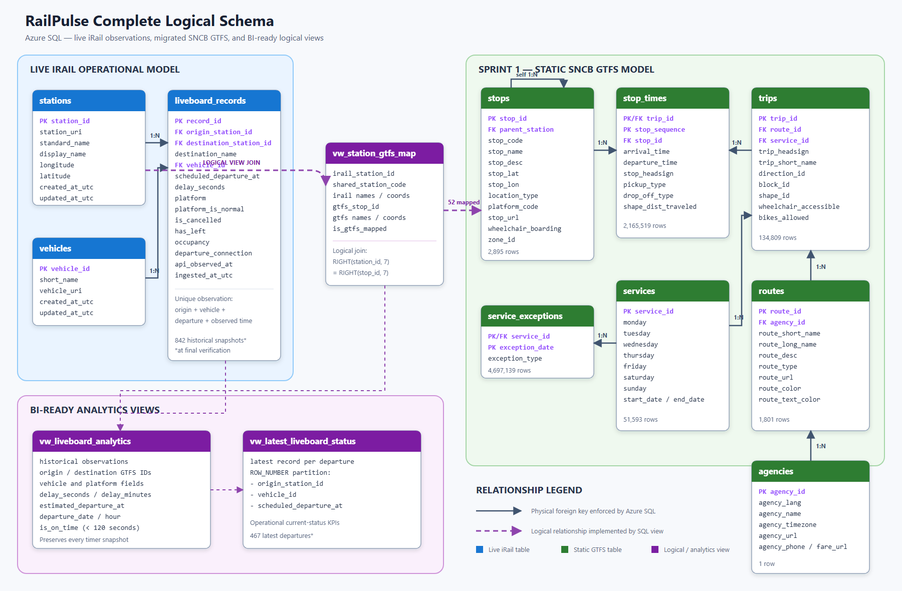

# RailPulse Cloud — Azure Serverless Ingestion

RailPulse is a serverless data-ingestion pipeline for Belgian railway
liveboards. A Python Azure Function requests live departure observations from
the public iRail API, transforms the JSON response, and stores normalized
records in Azure SQL Database.

## Project status

All functional requirements from the challenge are complete.

| Requirement | Implementation | Status |
|---|---|---|
| Operational HTTP endpoint | `ingest_liveboard` Azure Function | Complete |
| Live railway API ingestion | iRail liveboard API | Complete |
| Normalized Azure SQL schema | `stations`, `vehicles`, `liveboard_records` | Complete |
| Secure configuration | SQL connection string read from `os.environ` | Complete |
| Automated scheduling | Timer trigger every 30 minutes | Complete |
| Duplicate protection | Dimension upserts and observation uniqueness check | Complete |
| Multiple hubs | Antwerp, Ghent, and Liège | Complete |
| Monitoring | Application Insights logs and invocation history | Complete |

The challenge document describes the older **Consumption** portal flow. This
deployment uses **Flex Consumption**, Microsoft's current recommended
serverless option for new Linux Function Apps. The Azure SQL free offer also
provides a 32 GB allowance rather than the older 2 GB configuration described
in the brief. Overage billing is disabled, so the database pauses instead of
creating additional charges after the free monthly allowance is exhausted.

## Architecture

```text
HTTP request ─┐
              ├─> Azure Functions ─> iRail liveboard API
Timer trigger ┘          │
                         ├─ transform and validate
                         ├─ upsert stations and vehicles
                         └─ insert departure observations
                                      │
                                      v
                              Azure SQL Database

Azure Functions ─────────────> Application Insights
```

The complete logical schema, including the additional static GTFS model, is
shown below.



## Azure resources

The verified deployment uses:

| Resource | Configuration |
|---|---|
| Resource group | `rg-railpulse-dev` |
| Function App | Linux, Python 3.12, Flex Consumption, 512 MB |
| Azure SQL Database | General Purpose Serverless free offer |
| SQL overage | Disabled |
| Storage | Locally redundant storage (LRS) |
| Region | Switzerland North |
| Monitoring | Application Insights |

Switzerland North was selected because the Azure for Students subscription
policy rejected Belgium Central. Available regions must always be checked in
the subscription's **Allowed resource deployment regions** policy before
resources are created.

## Function pipeline

The application is divided into four responsibilities:

1. `function_app.py` defines the HTTP and timer triggers.
2. `src/irail_client.py` requests and validates an iRail liveboard response.
3. `src/pipeline.py` transforms API stations, vehicles, timestamps, flags, and
   departures into database-ready dictionaries.
4. `src/database.py` writes all rows in one transaction and rolls back the
   complete liveboard if an operation fails.

### HTTP trigger

The route accepts a station query parameter:

```text
GET /api/ingest_liveboard?station=Gent-Sint-Pieters
```

When no parameter is supplied, `Antwerp-Central` is used. A successful call
returns a JSON summary containing the station, received departures, processed
dimensions, transformed records, and inserted records.

### Timer trigger

The schedule `0 */30 * * * *` runs every 30 minutes for:

- Antwerp-Central
- Gent-Sint-Pieters
- Liège-Guillemins

Each station is isolated inside its own `try`/`except` block. A temporary iRail
failure for one station is logged without preventing the other stations from
being ingested.

## Database schema choice

The live data uses a normalized three-table model.

### `stations`

Stores one row per iRail station. The iRail station identifier is the primary
key. Names, URI, longitude, and latitude are updated when a station is observed
again.

### `vehicles`

Stores one row per observed train or service vehicle. The iRail vehicle
identifier is the primary key. Its display name and URI are updated on later
observations.

### `liveboard_records`

Stores time-stamped departure observations. Each row references:

- an origin station;
- an optional destination station;
- a vehicle.

It preserves the scheduled departure, delay, platform, cancellation and
departure flags, occupancy, connection URI, API observation time, and database
ingestion time.

The unique constraint on
`(origin_station_id, vehicle_id, scheduled_departure_at, api_observed_at)`
prevents the same API snapshot from being inserted twice. Repeated timer runs
with a new observation time are intentionally retained because they form the
historical delay series.

Schema creation is defined in [`docs/schema.sql`](docs/schema.sql).

## Additional GTFS enrichment

The previous SQL sprint's SNCB GTFS data was also migrated into seven related
tables:

| Table | Verified rows |
|---|---:|
| `agencies` | 1 |
| `routes` | 1,801 |
| `services` | 51,593 |
| `service_exceptions` | 4,697,139 |
| `stops` | 2,895 |
| `trips` | 134,809 |
| `stop_times` | 2,165,519 |

`vw_station_gtfs_map` connects live iRail stations to GTFS parent stations
through their shared seven-digit SNCB station code. The verified mapping
contains 52 mapped stations and 10 unmapped international stations. This is a
logical view relationship, not a physical foreign key.

The GTFS schema, indexes, importer, and logical views are maintained in:

- [`docs/gtfs_schema_azure.sql`](docs/gtfs_schema_azure.sql)
- [`docs/gtfs_indexes.sql`](docs/gtfs_indexes.sql)
- [`docs/analytics_views.sql`](docs/analytics_views.sql)
- [`scripts/migrate_gtfs_to_azure.py`](scripts/migrate_gtfs_to_azure.py)

## Security

- No password or SQL connection string is hardcoded in Python files.
- `src/database.py` reads `AZURE_SQL_CONNECTION_STRING` from `os.environ`.
- Local secrets are stored in `local.settings.json`, which is ignored by Git
  and excluded from Azure deployment packages.
- Azure uses the complete encrypted connection string as a Function App
  application setting.
- SQL public access is restricted by firewall rules; the developer's current
  client IP must be explicitly allowed.
- The Function App uses Azure-managed host and deployment storage.

The HTTP function is currently anonymous because this is a learning project.
For a production system, use function-level authentication or another API
protection layer and prefer managed identity over SQL username/password
authentication.

## Cost controls

- Function App: Flex Consumption with scale-to-zero behavior.
- Function instance size: 512 MB.
- SQL Database: free serverless offer.
- SQL overage billing: disabled.
- Storage replication: LRS.
- Zone redundancy: disabled for this learning deployment.
- Application Insights is enabled; telemetry volume should still be monitored.

## Project structure

```text
.
├── function_app.py
├── host.json
├── requirements.txt
├── src/
│   ├── database.py
│   ├── irail_client.py
│   └── pipeline.py
├── scripts/
│   ├── gtfs_import_config.py
│   └── migrate_gtfs_to_azure.py
├── docs/
│   ├── schema.sql
│   ├── gtfs_schema_azure.sql
│   ├── gtfs_indexes.sql
│   ├── analytics_views.sql
│   └── RailPulse_Complete_Logical_Schema.png
└── PROJECT_PROCESS_GUIDE.md
```

Only the Function runtime files are included in deployment. Documentation,
local reference material, migration scripts, secrets, virtual environments,
and caches are excluded through `.funcignore`.

## Verified result

The following outcomes were verified in Azure:

- The public HTTP endpoint successfully ingested Antwerp-Central and returned
  a structured JSON response.
- Azure SQL contains populated stations, vehicles, and liveboard observations.
- Application Insights recorded automatic half-hour executions.
- One verified timer cycle completed with three stations succeeded and zero
  stations failed.
- Azure SQL contained 842 historical observations and 467 distinct latest
  departures at final manual verification; these counts continue to grow.

## Known limitations

- iRail occasionally returns HTTP 500 for otherwise valid station requests.
  The timer isolates failures, but the API client does not yet implement HTTP
  retry with exponential backoff.
- Serverless Azure SQL can briefly return error `40613` while waking. Database
  connections retry known transient errors, so the first request can take
  longer than later requests.
- The HTTP route is anonymous and can trigger billable work if its hostname is
  distributed publicly.
- SQL username/password authentication remains in use. Managed identity would
  be a stronger production design.
- Dependency versions are not pinned in `requirements.txt`, reducing exact
  build reproducibility.

For the complete build, deployment, recovery, and troubleshooting process, see
[`PROJECT_PROCESS_GUIDE.md`](PROJECT_PROCESS_GUIDE.md).

## Data sources and references

- [iRail API documentation](https://docs.irail.be/)
- [Azure Functions Flex Consumption](https://learn.microsoft.com/azure/azure-functions/flex-consumption-plan)
- [Azure SQL Database firewall rules](https://learn.microsoft.com/azure/azure-sql/database/firewall-configure?view=azuresql)
- [Monitor Azure Functions](https://learn.microsoft.com/azure/azure-functions/functions-monitoring)
